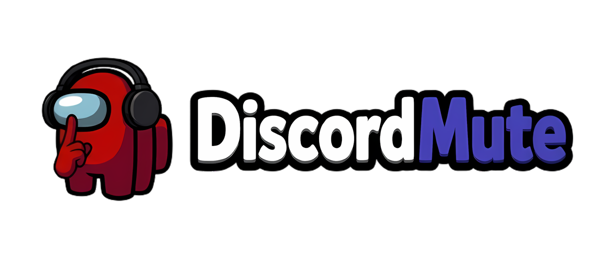

<div align="center">
  

  <p><strong>Automatic Discord voice muting for Among Us.</strong></p>

  <p>
    
    
    
    
    
    
  </p>
</div>

<br />

> DiscordMute is an Among Us companion mod that automatically mutes and unmutes players in Discord during a game, keeping voice chat aligned with the round state. It also supports EHR Blackmailer behavior, so blackmailed players stay muted during meetings instead of speaking normally in Discord.

## 1. Overview

I built DiscordMute because my friend group kept talking during live rounds and didn't want to manually mute and unmute themselves every game. It's made up of two pieces you install together: an Among Us plugin (`DLL`) and a Discord bot (`DiscordBot`).

## 2. Installation

### 2.1 Install BepInEx

DiscordMute requires BepInEx.

- If you already use another Among Us mod that ships with BepInEx, you can usually skip this step.
- Otherwise, download the correct BepInEx build for your Among Us version:
  - Steam: [`BepInEx-Unity.IL2CPP-win-x86-6.0.0-be.735+5fef357.zip`](https://builds.bepinex.dev/projects/bepinex_be/735/BepInEx-Unity.IL2CPP-win-x86-6.0.0-be.735%2B5fef357.zip)
  - Microsoft Store / Epic Games: [`BepInEx-Unity.IL2CPP-win-x64-6.0.0-be.735+5fef357.zip`](https://builds.bepinex.dev/projects/bepinex_be/735/BepInEx-Unity.IL2CPP-win-x64-6.0.0-be.735%2B5fef357.zip)
- Extract it into your Among Us folder first.

If the Steam version does not start or cannot connect to Steam correctly, make sure Steam is open. Also check that your Among Us folder contains a file named `steam_appid.txt` with this content:

```text
945360
```

### 2.2 Install the DiscordMute plugin

1. Open your Among Us folder.
2. Go to `BepInEx/plugins`.
3. Copy `DiscordMute.dll` into that folder.
4. Start Among Us once.
5. Close Among Us again.

After the first launch, DiscordMute creates its own config folder inside BepInEx.

Example path:

```text
C:\Steam\steamapps\common\Among Us-Modded\BepInEx\DiscordMute
```

Open `config.json` in that folder and configure it.

#### Plugin config

| Field                    | Meaning                                                                                                                     |
|--------------------------|-----------------------------------------------------------------------------------------------------------------------------|
| `ip`                     | IP address of the machine running the Discord bot. Use `localhost` when the bot runs on the same PC.                        |
| `pluginIp`               | IP address on which the plugin listens locally. Usually keep `localhost`.                                                   |
| `pluginPort`             | Port used by the Among Us plugin HTTP server. Default: `7263`.                                                              |
| `botPort`                | Port used by the Discord bot HTTP server. Default: `7264`.                                                                  |
| `secret`                 | Shared secret used by the plugin and the bot. Set the same value in both configs.                                           |
| `exe`                    | Full path to the bot start file. This should point to `start.bat` inside the `DiscordBot` folder from the downloaded ZIP.   |
| `bridgeLogsToBotConsole` | When `true`, forwards all plugin/BepInEx logs to the bot console. Own DiscordMute warnings and errors are always forwarded. |

Example:

```json
{
  "ip": "localhost",
  "pluginIp": "localhost",
  "pluginPort": 7263,
  "botPort": 7264,
  "secret": "replace-this-with-your-own-secret",
  "exe": "C:\\Path\\To\\DiscordBot\\start.bat",
  "bridgeLogsToBotConsole": false
}
```

### 2.3 Discord bot setup

1. Open the `DiscordBot` folder from the downloaded ZIP.
2. Rename `config.example.json` to `config.json`.
3. Create a Discord application and bot in the [Discord Developer Portal](https://discord.com/developers/applications).
4. Fill in the bot config.

#### Bot config

| Field         | Meaning                                                                 |
|---------------|-------------------------------------------------------------------------|
| `token`       | Bot token from the Discord Developer Portal.                            |
| `clientId`    | Application / client ID of your Discord bot.                            |
| `guildId`     | ID of the Discord server where the bot should be used.                  |
| `channelIds`  | Voice channel IDs used for Among Us sessions. Add one or more channels. |
| `secret`      | Must be exactly the same shared secret as in the plugin config.         |
| `botIp`       | IP address on which the bot listens. Usually `localhost`.               |
| `botPort`     | Port used by the Discord bot HTTP server. Default: `7264`.              |
| `plugin.ip`   | IP address of the Among Us plugin. Usually `localhost`.                 |
| `plugin.port` | Port used by the Among Us plugin HTTP server. Default: `7263`.          |

Example:

```json
{
  "token": "YOUR_BOT_TOKEN",
  "clientId": "YOUR_CLIENT_ID",
  "guildId": "YOUR_GUILD_ID",
  "channelIds": ["CHANNEL_ID_1"],
  "secret": "replace-this-with-your-own-secret",
  "botIp": "localhost",
  "botPort": 7264,
  "plugin": {
    "ip": "localhost",
    "port": 7263
  }
}
```

### 2.4 First start

Once both configs are set up:

1. Start Among Us.
2. Create a lobby as host.
3. The Discord bot should start automatically through the `exe` path configured in the plugin.
4. Join the configured Discord voice channel and play.

## 3. Linking Discord users to Among Us players

DiscordMute needs to know which Discord user belongs to which Among Us player name before it can mute the correct person.

The normal flow is:

1. A player runs `/link` in Discord.
2. The bot replies with a short one-time phrase such as `link-AB12`.
3. The player opens Free Chat in an Among Us lobby and sends that phrase exactly.
4. The plugin catches the phrase before it appears in chat, sends the detected Among Us name back to the bot, and the account is linked.

Link phrases expire after 5 minutes. Once a link succeeds, the bot stores it in `DiscordBot/linking.json`, and the plugin stores the local copy it needs in `BepInEx/DiscordMute/linking.json`.

### Discord bot commands

| Command                         | Purpose                                                                                                                      |
|---------------------------------|------------------------------------------------------------------------------------------------------------------------------|
| `/link`                         | Starts the normal self-link flow for the Discord user who runs the command.                                                  |
| `/force-link user display-name` | Lets a server admin manually link a Discord user to an Among Us display name. Useful if the normal flow cannot be completed. |
| `/testconnection`               | Checks whether the Discord bot can reach the Among Us plugin. Useful while setting up or debugging the integration.          |

### About `linking.json`

`linking.json` is created automatically after the first successful link.

- `DiscordBot/linking.json` is used by the bot to map Discord user IDs to Among Us display names.
- `BepInEx/DiscordMute/linking.json` is used by the plugin to keep its local link state in sync.
- You normally do not need to edit either file by hand.
- If a player changes their Among Us name, they should run `/link` again or an admin can use `/force-link`.

## 4. Optional mod integration

DiscordMute also integrates with supported host mods when they are installed:

- `Town Of Host Enhanced` or `Endless Host Roles` can provide more accurate player-name resolution.
- `Endless Host Roles` additionally enables Blackmailer support. When an EHR Blackmailer silences a player during a meeting, DiscordMute treats that player like a muted/dead player for the Discord voice sync and keeps them muted instead of allowing them to speak normally in the meeting.

If EHR is not installed, DiscordMute still works normally; only EHR-specific Blackmailer support is disabled.

## 5. Features

- **Automatic mute sync**: players are muted and unmuted in Discord in step with the Among Us round state.
- **EHR Blackmailer support**: when installed alongside Endless Host Roles, a blackmailed player stays muted during meetings instead of being able to speak.
- **Host mod integration**: Town Of Host Enhanced and Endless Host Roles improve player-name resolution when present.
- **Self-service linking**: players link their Discord account to their Among Us name in-game with a one-time phrase, no manual admin setup required.
- **Log bridging**: optionally forward plugin/BepInEx logs to the bot console for easier debugging.

<details>
<summary><h2 style="display:inline;">6. Technical details</h2></summary>

### Tech Stack

| Component    | Stack                                                                                 |
|--------------|---------------------------------------------------------------------------------------|
| `DLL`        | C# (.NET 6) + [BepInEx](https://github.com/BepInEx/BepInEx) IL2CPP plugin             |
| `DiscordBot` | [Bun](https://bun.sh/) + TypeScript + [discord.js](https://discord.js.org/) + Express |

The bot is distributed as a compiled `bot.exe` (via `bun build --compile`), so end users don't need Bun or Node.js installed to run a release build.

### Repository Structure

```text
AmongUs-DiscordMute/
├── DLL/           # C# / BepInEx Among Us plugin
├── DiscordBot/     # Bun + TypeScript Discord bot
├── assets/         # Logos and images
└── update.example.ps1
```

</details>

---

<div align="center">
  <sub>Licensed under <a href="LICENSE">GPLv3</a>.</sub>
</div>
